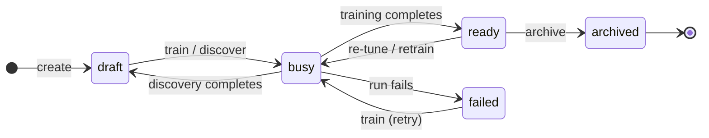

A model has a **lifecycle**: a small set of states it moves through from first definition to serving scores. The same path covers every model — create it, add [supervision](/concepts/supervision), [train](/concepts/training), and score. Changes to what a model measures happen while it is a draft; once trained, that definition is fixed for the model's lineage.

## States

| State | Meaning |
|-------|---------|
| `draft` | Created and accepting trait and sample edits. Not yet scorable. |
| `busy` | An asynchronous operation is running — training, discovery, or a background retrain. The model reports which one. |
| `ready` | Trained and serving scores against an active [version](/concepts/versions). |
| `failed` | The last run did not complete. Correct the supervision and train again. |
| `archived` | Stopped serving. Samples and version history are retained — archiving is not permanent deletion. |

## Mechanism

One pattern drives the states: **create → supervise → train → score**, with optional refinement after.

- **Create** produces a `draft`. A draft is where the model's [traits](/concepts/traits) and [samples](/concepts/samples) are defined.
- **Trait and sample edits are draft-only.** Adding, changing, or removing traits and explicit samples applies only while the model is a `draft`. Once trained, those edits are no longer accepted — a different standard means a new model, not an edit to a serving one. ([Feedback](/concepts/supervision) still appends samples to a serving model; it adds to the next retrain rather than editing the trained definition.)
- **Train** moves a draft to `busy`, then to `ready` on success or `failed` on error. This first run is a [cold start](/concepts/training): the model becomes scorable from whatever supervision it has.
- **[Discovery](/concepts/discovery)** runs on a draft, attaches intrinsic traits, and returns the model to `draft` — ready to train.
- **Score** serves the active version of a `ready` model. Scoring stays available throughout a background retrain: the model keeps serving its current version until the new one swaps in atomically, so a request never waits on a run and never sees a half-trained snapshot.
- **[Feedback](/concepts/supervision)** on a score request records labels for the scored content as new samples, accumulating for the next retrain — **online learning** that does not interrupt scoring.

## Interpretation

- Plan a **discover-then-train arc**, not iterative edits on a serving model. Shape the draft — traits, samples, discovery — then train it into a version.
- A model is scorable only after it has reached `ready` at least once. While `busy` after that, the previous version keeps serving.
- A new standard is a new model. Locking the trait set at `ready` keeps a lineage coherent — every version measures the same axes, and a rollback returns to a known definition.

## Edge cases

- Training and discovery are **asynchronous**. The call returns once the run is enqueued and the model reports `busy`; poll the model's state rather than blocking on the call.
- A `failed` run leaves the model's definition intact — add or correct supervision and train again from the same draft.
- Explicit samples are added while a model is a `draft`; on a model already serving scores, [feedback](/concepts/supervision) is the path that adds samples.

## Next

<Columns cols={2}>
  <Card title="Training" icon="graduation-cap" href="/concepts/training">
    What a training run does to a model.
  </Card>
  <Card title="Versions" icon="code-branch" href="/concepts/versions">
    The snapshots each training run produces.
  </Card>
</Columns>
