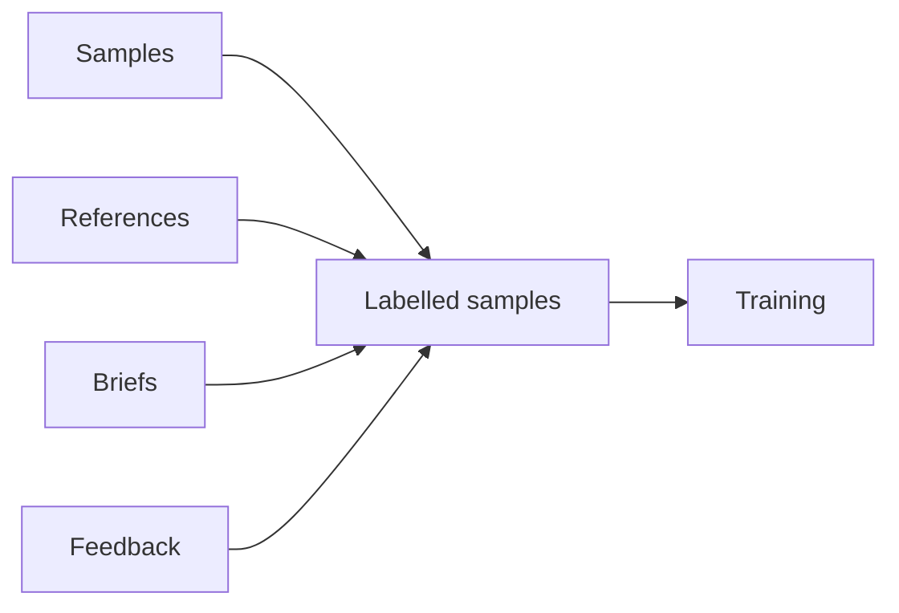

**Supervision** is the guidance you give a model about what good means. It comes in four forms — samples, references, briefs, and feedback — and every form resolves to labelled [samples](/concepts/samples) that [training](/concepts/training) consumes.

## Definition

Supervision is any demonstration of the standard a model should learn. The four forms differ in how directly they express that standard — from explicit labelled examples to behavioral signals collected during scoring. Internally they converge: each form is translated into labelled samples before the engine runs. The choice of form is about how you prefer to express judgment, not about what a model can learn.

## Mechanism

| Form | What you provide | How it reaches the model |
|------|------------------|--------------------------|
| **Samples** | Labelled examples — content with a label per trait. | Sent directly; the most explicit form. |
| **References** | Artifacts that already embody the standard — documents, exemplar content. | Read and distilled into samples at build time. |
| **Briefs** | Articulated intent — a structured description of what you want. | Synthesized into samples at build time. |
| **Feedback** | Labels captured during scoring. | Appended as samples for continuous learning. |

Each form is provided through a concrete mechanism:

- **[Samples](/concepts/samples)** — sent as JSON to the [REST API](/api-reference/introduction) or [MCP](/api-reference/mcp) `add_samples`, or supplied as [JSONL files](/api-reference/authoring-schemas) for a file-based build.
- **References** — supplied as [sources](/api-reference/authoring-schemas#sources) in a file-based build: a local or remote file, a dataset, or a document fetched by URL, distilled into samples before training.
- **[Briefs](/concepts/briefs)** — the minimal specification of a trait — its poles, a question, a short description — that the [build](/concepts/training) hydrates into samples.
- **Feedback** — a `feedback` map on a [score](/concepts/score-card) request records labels for the scored content; those labels accumulate as samples and fold into the next [version](/concepts/versions). This is how a [ready](/concepts/model-lifecycle) model keeps learning — **online learning** — without leaving service.

## Interpretation

Reach for the form that matches what you have:

- **Samples** when you already have labelled data.
- **References** when the standard lives in documents or exemplar content.
- **Briefs** when you can describe the standard but have no data — the fastest path to a first model.
- **Feedback** to keep a live model improving from real traffic.

The forms compose. A brief can seed a model that feedback then refines, and supplied samples can sit alongside synthesized ones. [Cold start](/concepts/training) works from any single form: a model becomes scorable from a brief alone, before any usage data exists.

## Edge cases

- Every form reduces to samples, so [score-card](/concepts/score-card) semantics are identical no matter how a model was supervised.
- Explicit samples and references shape a [draft](/concepts/model-lifecycle) before training; feedback is the only form that adds to a model already serving scores.

## Next

<Columns cols={2}>
  <Card title="Samples" icon="tags" href="/concepts/samples">
    The direct form, and the one every other resolves to.
  </Card>
  <Card title="Briefs" icon="clipboard-list" href="/concepts/briefs">
    Supervision by description, synthesized into samples.
  </Card>
</Columns>
