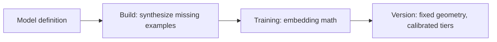

**Training** turns a model's [supervision](/concepts/supervision) into a fixed scoring geometry. It fits each [trait](/concepts/traits)'s axis in embedding space and calibrates the [breaks](/concepts/tiers#breaks) that separate score [tiers](/concepts/tiers), producing a [version](/concepts/versions) that serves deterministic scores.

## Definition

Training is the lifecycle transition that produces a trained model. It consumes the model's samples, fits the geometry of each trait, and records the calibrated thresholds as a [version](/concepts/versions). Training runs **no language model** — it is embedding math, and its output is fully determined by its inputs.

## Mechanism

A model can be specified in full — every example supplied — or minimally, with only the essentials of each trait: a name, a question, or a pair of poles. Before the math runs, a **build** step hydrates a minimal specification into a complete one, synthesizing the examples and pole exemplars the author did not supply. The training engine always sees a fully-specified model.

Synthesis happens only at build time. It never runs at score time, and it is separate from the training math — so a trained model is reproducible and its scores carry no language-model dependency. A fully-specified model makes the build a no-op: the engine sees exactly the examples supplied.

Training also **calibrates** each trait against its own training distribution. It places the [breaks](/concepts/tiers#breaks) at cluster quartiles, sets the [confidence](/concepts/confidence) regions, and fixes the [tier](/concepts/tiers) boundaries. Calibration is per-trait and re-derived on every run, so the same raw score can map to different tiers across traits or across versions.

## Effort

How much cost and time a build spends is set by **effort**, an authoring level from `low` to `max` that defaults to `high`. Higher effort spends more on synthesis and searches more thoroughly for the best scoring configuration, raising quality at proportional cost. The full set of levels is documented with the [authoring schemas](/api-reference/authoring-schemas).

Effort applies to a cold start or an explicit re-tune. Routine background retrains reuse the existing configuration and run no search.

## Interpretation

- **Cold start** is training the first time: a model becomes scorable from whatever supervision it has, with no prior usage data required.
- After the first run, [feedback](/concepts/supervision) accumulates new samples and a background retrain folds them in, producing a fresh [version](/concepts/versions) without re-searching the configuration. This keeps a serving model current cheaply.
- An explicit **re-tune** searches for a new configuration — worth the cost when the data has changed enough to warrant it.

## Edge cases

- Training is asynchronous: the model reports [`busy`](/concepts/model-lifecycle) while a run executes and returns to `ready` (or `failed`) when it finishes.
- A re-tune on a `ready` model runs a full search; without it, a `ready` model trains incrementally through the background retrain rather than re-searching.
- Background retrains run no configuration search, so they are fast; only a cold start or an explicit re-tune searches.

## Next

<Columns cols={2}>
  <Card title="Tiers & breaks" icon="ranking-star" href="/concepts/tiers">
    The thresholds training calibrates.
  </Card>
  <Card title="Versions" icon="code-branch" href="/concepts/versions">
    The snapshot each run records.
  </Card>
</Columns>
